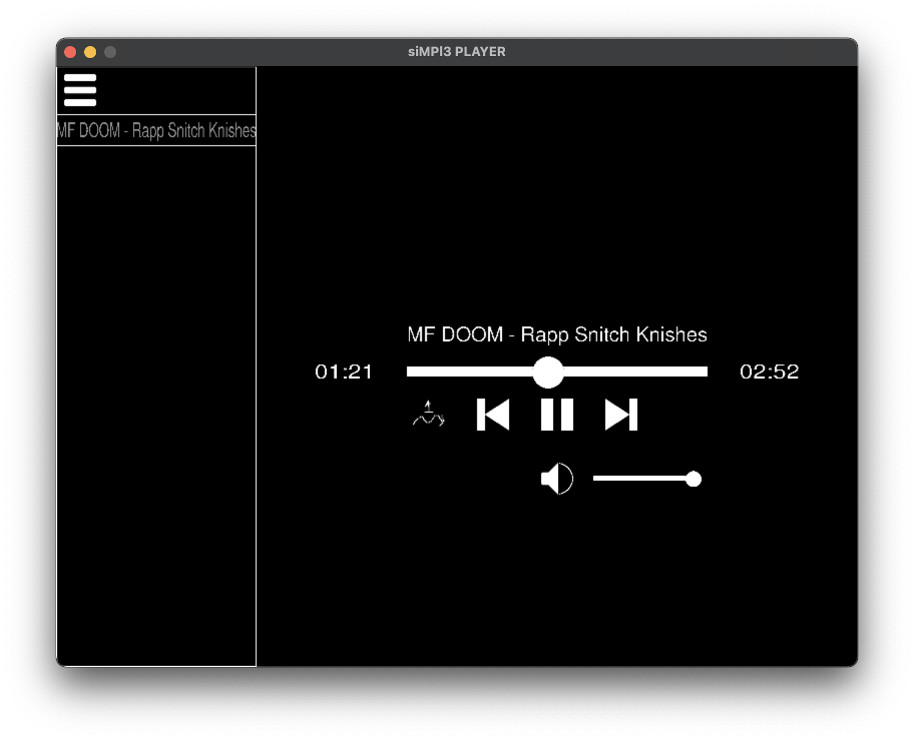

# siMPl3 player
Simple MP3 player made with C, [SDL3](https://github.com/libsdl-org/SDL) and [miniaudio](https://github.com/mackron/miniaudio).

* Start playback passing an mp3 as argument or a directory
* Drag and drop, drop an mp3 file or drop a directory with mp3 to create a playlist
* Loop and shuffle playback

Only works with macOS, to build it you need SDL3, SDL3_image and SDL3_ttf library compiled and installed on your system, then use build.sh script to compile it (only for mac or linux).
